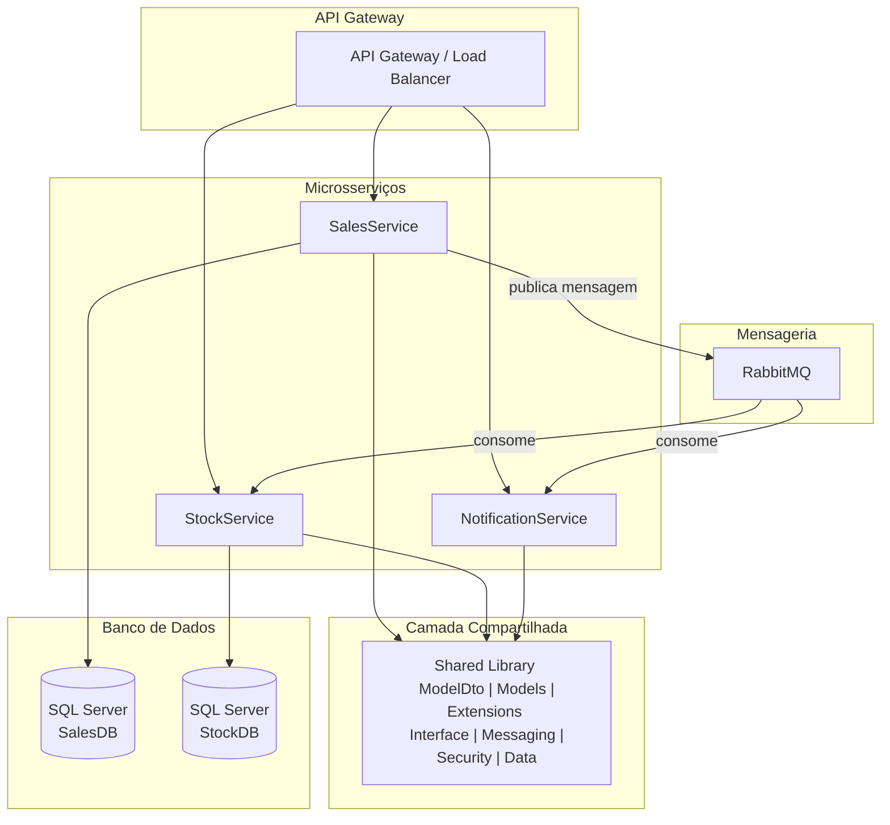

# StockService Microservice

Microserviço responsável pelo gerenciamento de estoque de produtos.

## Pré-requisitos

- Docker Desktop
- .NET 9.0 SDK
- Docker Compose

## Como Executar

1. Clone o repositório
2. Navegue até a pasta do StockService
3. Execute:

```bash
docker-compose up -d
```

O serviço estará disponível em: http://localhost:5002

## Endpoints Principais

- `GET /api/products` - Lista todos os produtos
- `GET /api/products/{id}` - Obtém um produto específico
- `POST /api/products` - Cria um novo produto
- `PUT /api/products/{id}` - Atualiza um produto

## Variáveis de Ambiente

| Variável | Descrição | Valor Padrão |
|----------|-----------|--------------|
| ConnectionStrings__DefaultConnection | String de conexão com SQL Server | - |
| RabbitMQ__HostName | Host do RabbitMQ | rabbitmq |
| RabbitMQ__ExchangeName | Nome da exchange | stock_events |

## Acesso aos Serviços

- **SQL Server Management**: Conecte-se a `localhost,1433` com usuário `sa`
- **RabbitMQ Management**: http://localhost:15672 (usuário: guest, senha: guest)

## Migrações do Banco de Dados

Para aplicar migrações durante o desenvolvimento:

```bash
dotnet ef database update
```

## Diagrama de Arquitetura

